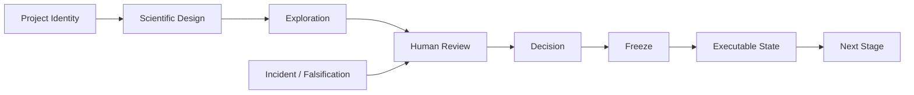

# Architecture

ARIS Research OS is a research governance and project-management layer. It is
agent-agnostic: it may govern Codex, Claude Code, OpenClaw, other LLM agents,
or human analysts without depending on any single agent platform.

The system is organized into three layers.

## A. Governance Layer

The governance layer owns the decisions that keep research convergent and
auditable.

- **Project identity** — `PROJECT_IDENTITY.yaml`, canonical root, forbidden
  roots, foreign-project signatures.
- **Constraints** — `CONSTRAINTS.yaml` (HARD / FROZEN / SOFT / EXPERIMENTAL).
- **Decisions** — append-only decision register and human decision packets.
- **Gates** — identity, preflight, freeze, result review, external replay,
  destructive operation.
- **Freeze** — frozen executable state and freeze-on-accept.
- **Incident management** — stop, preserve, audit, classify, recover, learn.

## B. Execution Layer

The execution layer performs work under governance control.

- **Agents** — Professor, Executor, Writer, Reviewer, Literature Curator,
  Figure/Table Curator.
- **Skills** — reusable behavioral contracts under `skills/`.
- **CLI** — `aris_os.cli` control-plane commands.
- **External tools** — analysis scripts, database clients, and agent
  platforms invoked through preflight and gate checks.

## C. Evidence Layer

The evidence layer records what was produced and why it is trusted.

- **Results** — `RESULTS_LEDGER.csv` with stable result IDs.
- **Artifacts** — `FROZEN_ARTIFACT_REGISTRY.csv`.
- **Frozen parameters** — `FROZEN_PARAMETER_REGISTRY.csv`.
- **Provenance** — producer scripts, hashes, and lineage links.
- **Claims** — `CLAIM_LEDGER.csv` connecting claims to evidence.
- **Manuscripts** — living manuscript state synced only to accepted evidence.

## Control flow

Only ACCEPTED or FROZEN objects may support downstream authoritative work.
Project identity precedes reproducibility: a technically correct reproduction
of the wrong project is still a failure.
