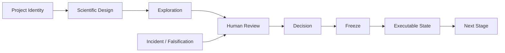

# ARIS Research OS


[简体中文](README.md)

**A governance layer for long-running, multi-agent scientific research.**

## Why ARIS Research OS exists

Large research projects fail from state loss, stale evidence, version drift,
fragmented writing, cross-project confusion, and unmanaged iteration as often
as from analytical limitations. ARIS Research OS addresses the management side
of that problem.

## Relationship to ARIS

ARIS Research OS was inspired by ARIS (Auto Research In Sleep，https://github.com/wanshuiyin/Auto-claude-code-research-in-sleep)
, particularly
the idea of autonomous and iterative research workflows. ARIS Research OS
extends that inspiration toward long-horizon research governance, emphasizing
human-in-the-loop scientific decisions, project identity, staged convergence,
frozen executable states, provenance, auditability, and cross-agent
reproducibility.

This is **not** the official ARIS project and is not a fork of upstream ARIS
code. It is an independently implemented project inspired by ARIS.

## What it does

ARIS Research OS is an ARIS-inspired governance layer for long-running,
multi-agent scientific research. It does not primarily execute experiments or
replace human scientific judgment. Instead, it manages:

- project identity and canonical-root locking,
- staged review, decision, and freeze,
- provenance and parameter persistence,
- reproducibility levels,
- external-validation governance,
- human-in-the-loop decisions,
- incident detection and recovery,
- progressive research convergence.

## What it does NOT do

- It does **not** run experiments itself.
- It does **not** replace domain expertise.
- It does **not** make final scientific decisions.
- It does **not** guarantee scientific truth.

The human decides **what** the science should be. Agents ensure execution
remains consistent with that science.

## Core principles

> Research should gradually converge, not remain perpetually fluid.

Research progresses as:

```text
Explore -> Decide -> Audit -> Freeze -> Compress -> Advance
```

Explore a stage, adjudicate it, freeze the accepted state, compress the
context, and advance. Later stages consume structured frozen state rather than
reconstructing scientific decisions from long chat histories.

## Architecture

Three layers work together:

1. **Governance** — identity, constraints, decisions, gates, freeze, incidents.
2. **Execution** — agents, skills, CLI, external tools.
3. **Evidence** — results, artifacts, frozen parameters, provenance, claims,
   manuscripts.

See [ARCHITECTURE.md](ARCHITECTURE.md).



## Human-agent division of responsibility

- **Human** decides the scientific question, cohort/endpoint redesign,
  primary-vs-sensitivity hierarchy, irreversible choices, manuscript claims,
  and publication strategy.
- **Agents** handle implementation, path checking, project identity, hash
  checking, provenance, parameter persistence, reproduction, consistency
  audit, error detection, and evidence presentation.

> The human should not need to inspect hundreds of lines of implementation
> instructions to prevent routine path or configuration errors.

## Main governance gates

| Gate | Purpose |
|---|---|
| `GATE_PROJECT_IDENTITY` | Confirm project identity before execution |
| `EXECUTION_PREFLIGHT` | Verify execution context before code runs |
| `GATE_EXECUTABLE_FREEZE` | Confirm the complete frozen state |
| `GATE_RESULT_REVIEW` | Audit before interpretation |
| `GATE_EXTERNAL_REPLAY` | Require replay before a new external database |
| `GATE_DESTRUCTIVE_OPERATION` | Require human authorization |

## Research convergence workflow

At each meaningful stage:

1. Perform analysis.
2. Inspect evidence.
3. Resolve uncertainty.
4. Obtain human approval or rejection.
5. Freeze the accepted state.
6. Compress historical context.
7. Advance from the frozen state.

Object states: `OPEN`, `PROVISIONAL`, `AUDITED`, `ACCEPTED`, `FROZEN`,
`SUPERSEDED`, `FAILED_RETAINED`. Only `ACCEPTED`/`FROZEN` objects support
downstream authoritative work.

## Frozen Executable State

When a human decision marks a result `ACCEPT`, `PRIMARY`, `FINAL`, or `FROZEN`,
ARIS freezes the complete executable state: design, cohort, input contract,
variable order, units, missingness and cleaning rules, scalar parameters,
seeds, thresholds, fitted objects, runtime-derived objects, reference
population state, model checkpoints, normalization constants, calibration
objects, exact code, hashes, environment, output contract, and smoke-test
input/output.

## Installation

```bash
git clone https://github.com/duyang1994/ARIS-Research-OS
cd ARIS-Research-OS
python -m pip install -e .
```

Requires Python 3.10 or later. The runtime has no third-party dependencies.

## Quickstart

```bash
python -m aris_os.cli bootstrap-project-v02 --root C:\Research\ProjectAlpha
python -m aris_os.cli gate-identity --root C:\Research\ProjectAlpha \
  --project-id PROJECT-ALPHA --canonical-root C:\Research\ProjectAlpha
python -m aris_os.cli preflight --root C:\Research\ProjectAlpha \
  --write-target C:\Research\ProjectAlpha\analysis\stage01 \
  --upstream-freeze-id FREEZE-20260101-0001 \
  --expected-output C:\Research\ProjectAlpha\analysis\stage01\results.json
```

See [QUICKSTART.md](QUICKSTART.md) for a complete, synthetic example.

## Example project bootstrap

```bash
python -m aris_os.cli bootstrap-project-v02 --root C:\Research\ProjectAlpha
```

This creates identity, status, index, governance, freeze, and audit
scaffolding without touching scientific data or inferring scientific
definitions. A minimal synthetic example lives in
[`examples/project_alpha`](examples/project_alpha).

## CLI commands

```text
init-project            initialize a v0.2 project
bootstrap-project-v02   add governance scaffolding to an existing project
gate-identity           run GATE_PROJECT_IDENTITY
preflight               run execution preflight
freeze-check            verify a frozen executable state manifest
external-replay-gate    run GATE_EXTERNAL_REPLAY
destructive-gate        run GATE_DESTRUCTIVE_OPERATION
classify-failure        classify a change or failure
reproducibility         resolve a reproducibility level name
status                  show state-store tables
add-event               add a research event
daily-brief             print a PI daily brief
```

## Skills

Fourteen governance skills plus six v0.1 role skills are defined under
[`skills/`](skills). See [skills/README.md](skills/README.md).

## Project structure

See [docs/CANONICAL_PROJECT_TREE.md](docs/CANONICAL_PROJECT_TREE.md) for the
canonical per-project layout.

## Incident / recovery model

`DETECT -> STOP -> PRESERVE -> DEFINE BOUNDARY -> READ-ONLY FORENSIC AUDIT ->
CLASSIFY IMPACT -> HUMAN REVIEW -> CONTROLLED RECOVERY -> POST-RECOVERY AUDIT
-> LESSON -> GOVERNANCE UPDATE`.

Suspected contamination is never deleted immediately; evidence is preserved
first.

## Reproducibility levels R0-R5

```text
R0 RESULT_ONLY
R1 CODE_PRESERVED
R2 PARAMETER_COMPLETE
R3 EXECUTABLE_FREEZE
R4 CLEAN_ENVIRONMENT_REPRODUCED
R5 EXTERNALIZATION_VERIFIED
```

Cross-database external validation requires at least `R5`.

## Current status

`v0.2.0` is prepared for public release. See
[PUBLIC_RELEASE_STATUS.md](PUBLIC_RELEASE_STATUS.md) and
[RELEASE_NOTES_v0.2.0.md](RELEASE_NOTES_v0.2.0.md).

## Limitations

See [KNOWN_LIMITATIONS.md](KNOWN_LIMITATIONS.md). Governance cannot guarantee
scientific correctness; human adjudication remains necessary for scientific
redesign; and reproducibility depends on the persistence of required
artifacts.

## License

Apache License 2.0. See [LICENSE](LICENSE) and [NOTICE](NOTICE).

## Contributing

See [CONTRIBUTING.md](CONTRIBUTING.md) and
[CODE_OF_CONDUCT.md](CODE_OF_CONDUCT.md).

## Citation / attribution

See [CITATION.cff](CITATION.cff).
