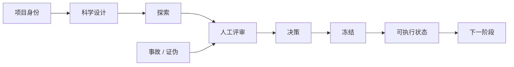

# ARIS Research OS


[English](README.en.md)

**面向长期运行、多智能体科学研究的治理层。**

## 为什么需要 ARIS Research OS

大型研究项目失败的原因，除了分析方法本身，往往还有状态丢失、证据过时、版本漂移、写作碎片化、跨项目混淆以及迭代失控。ARIS Research OS 解决的是这些**管理层面**的问题。

## 与 ARIS 的关系

ARIS Research OS 的灵感来自 ARIS（Auto Research In Sleep，https://github.com/wanshuiyin/Auto-claude-code-research-in-sleep），尤其是其中「自主、迭代式研究工作流」的思想。ARIS Research OS 把这一灵感延伸到长周期科研治理上，强调：

- 人在环中的科学决策
- 项目身份（project identity）
- 分阶段收敛
- 冻结可执行状态
- 溯源与可审计性
- 跨智能体可复现性

本项目**不是**官方 ARIS 项目，也**不是**上游 ARIS 代码的 fork。它是在 ARIS 启发下独立实现的项目。

## 它做什么

ARIS Research OS 是一个受 ARIS 启发的治理层。它本身不负责执行实验，也不替代人类的科学判断，而是管理：

- 项目身份与规范根目录锁定
- 分阶段评审、决策与冻结
- 溯源与参数持久化
- 可复现性等级
- 外部验证治理
- 人在环中的决策
- 事故检测与恢复
- 渐进式研究收敛

## 它不做什么

- 它**不**亲自运行实验。
- 它**不**替代领域专业知识。
- 它**不**做最终科学决策。
- 它**不**保证科学上的正确性。

人类决定科学「应该是什么」，智能体确保执行始终与该科学保持一致。

## 核心原则

> 研究应当逐步收敛，而不是永远处于流动状态。

研究按以下方式推进：

```text
探索 -> 决策 -> 审计 -> 冻结 -> 压缩 -> 前进
```

探索一个阶段、裁决它、冻结被接受的状态、压缩上下文，然后前进。后续阶段消费结构化的冻结状态，而不是从漫长的聊天记录里重建科学决策。

## 架构

三个层次协同工作：

1. **治理层** — 身份、约束、决策、门禁、冻结、事故。
2. **执行层** — 智能体、技能、CLI、外部工具。
3. **证据层** — 结果、工件、冻结参数、溯源、结论、手稿。

详见 [ARCHITECTURE.md](ARCHITECTURE.md)。



## 人类与智能体的职责划分

- **人类**决定科学问题、队列/终点再设计、主分析/敏感性分析层级、不可逆选择、手稿结论和发表策略。
- **智能体**负责实现、路径检查、项目身份验证、哈希检查、溯源、参数持久化、复现、一致性审计、错误检测和证据呈现。

> 人类不应为了防范常规路径或配置错误，而去阅读数百行实现说明。

## 主要治理门禁

| 门禁 | 作用 |
|---|---|
| `GATE_PROJECT_IDENTITY` | 在执行前确认项目身份 |
| `EXECUTION_PREFLIGHT` | 在代码运行前校验执行上下文 |
| `GATE_EXECUTABLE_FREEZE` | 确认冻结状态完整 |
| `GATE_RESULT_REVIEW` | 先审计、后解读 |
| `GATE_EXTERNAL_REPLAY` | 新外部数据库前要求回放 |
| `GATE_DESTRUCTIVE_OPERATION` | 要求人类授权 |

## 研究收敛流程

在每个有意义的阶段：

1. 进行分析。
2. 检查证据。
3. 解决不确定性。
4. 取得人类批准或拒绝。
5. 冻结被接受的状态。
6. 压缩历史上下文。
7. 从冻结状态前进。

对象状态包括：`OPEN`、`PROVISIONAL`、`AUDITED`、`ACCEPTED`、`FROZEN`、
`SUPERSEDED`、`FAILED_RETAINED`。只有 `ACCEPTED`/`FROZEN` 对象可以支撑下游权威工作。

## 冻结可执行状态

当人类决策把某个结果标记为 `ACCEPT`、`PRIMARY`、`FINAL` 或 `FROZEN` 时，ARIS 会冻结完整的可执行状态：设计、队列、输入契约、变量顺序、单位、缺失与清洗规则、标量参数、随机种子、阈值、拟合对象、运行时派生对象、参考总体状态、模型检查点、归一化常数、校准对象、精确代码、哈希、运行环境、输出契约，以及冒烟测试输入/输出。

## 安装

```bash
git clone https://github.com/duyang1994/ARIS-Research-OS
cd ARIS-Research-OS
python -m pip install -e .
```

需要 Python 3.10 或更高版本。运行时没有第三方依赖。

## 快速开始

```bash
python -m aris_os.cli bootstrap-project-v02 --root C:\Research\ProjectAlpha
python -m aris_os.cli gate-identity --root C:\Research\ProjectAlpha \
  --project-id PROJECT-ALPHA --canonical-root C:\Research\ProjectAlpha
python -m aris_os.cli preflight --root C:\Research\ProjectAlpha \
  --write-target C:\Research\ProjectAlpha\analysis\stage01 \
  --upstream-freeze-id FREEZE-20260101-0001 \
  --expected-output C:\Research\ProjectAlpha\analysis\stage01\results.json
```

完整的合成示例见 [QUICKSTART.md](QUICKSTART.md)。

## 示例项目初始化

```bash
python -m aris_os.cli bootstrap-project-v02 --root C:\Research\ProjectAlpha
```

该命令会创建身份、状态、索引、治理、冻结和审计脚手架，不会改动科学数据，也不会自动推断科学定义。一个最小的合成示例位于
[`examples/project_alpha`](examples/project_alpha)。

## CLI 命令

```text
init-project            初始化一个 v0.2 项目
bootstrap-project-v02   为已有项目添加治理脚手架
gate-identity           运行 GATE_PROJECT_IDENTITY
preflight               运行执行预检
freeze-check            校验冻结可执行状态清单
external-replay-gate    运行 GATE_EXTERNAL_REPLAY
destructive-gate        运行 GATE_DESTRUCTIVE_OPERATION
classify-failure        对变更或故障进行分类
reproducibility         解析可复现性等级
status                  显示状态库各表
add-event               记录研究事件
daily-brief             打印 PI 每日简报
```

## 技能

`skills/` 下定义了 14 个治理技能和 6 个 v0.1 角色技能，详见
[skills/README.md](skills/README.md)。

## 项目结构

规范的单项目目录结构见
[docs/CANONICAL_PROJECT_TREE.md](docs/CANONICAL_PROJECT_TREE.md)。

## 事故 / 恢复模型

`检测 -> 停止 -> 保全 -> 界定边界 -> 只读取证审计 -> 影响分级 -> 人工评审 ->
受控恢复 -> 恢复后审计 -> 经验 -> 治理更新`。

疑似污染绝不会被立即删除，而是先保全证据。

## 可复现性等级 R0–R5

```text
R0 仅结果
R1 代码已保存
R2 参数完整
R3 可执行冻结
R4 干净环境复现
R5 已验证外部化
```

跨数据库外部验证至少需要达到 `R5`。

## 当前状态

`v0.2.0` 已准备好公开发布。详见
[PUBLIC_RELEASE_STATUS.md](PUBLIC_RELEASE_STATUS.md) 和
[RELEASE_NOTES_v0.2.0.md](RELEASE_NOTES_v0.2.0.md)。

## 局限性

见 [KNOWN_LIMITATIONS.md](KNOWN_LIMITATIONS.md)。治理无法保证科学正确性；科学再设计仍需人工裁决；可复现性也依赖于所需工件的持久化。

## 许可证

Apache License 2.0。见 [LICENSE](LICENSE) 与 [NOTICE](NOTICE)。

## 参与贡献

见 [CONTRIBUTING.md](CONTRIBUTING.md) 与
[CODE_OF_CONDUCT.md](CODE_OF_CONDUCT.md)。

## 引用 / 归属

见 [CITATION.cff](CITATION.cff)。
